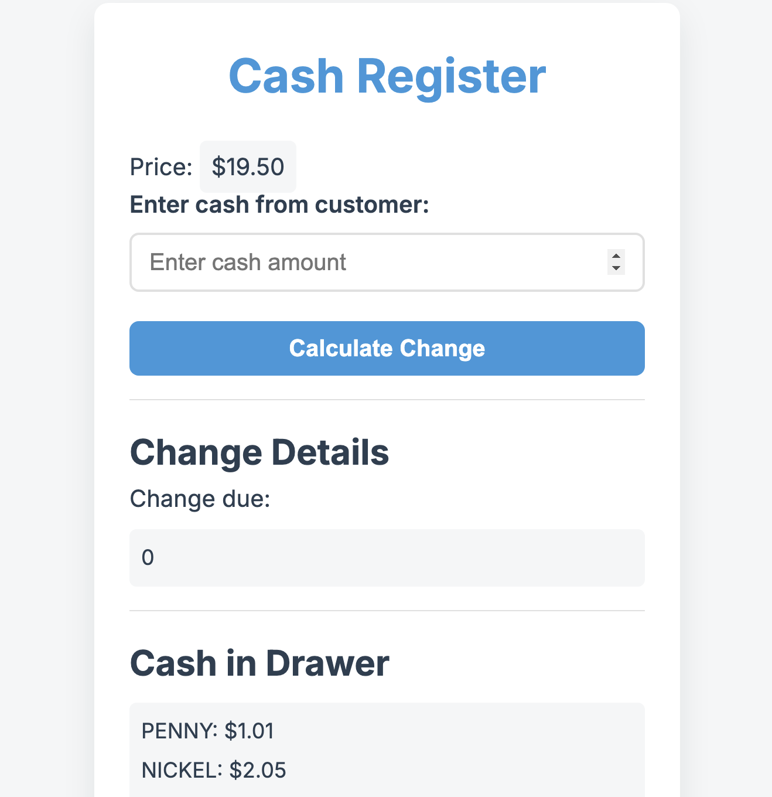

# Cash Register Change Calculator 💰

## Project Overview

This is a simple, modern web application that helps calculate change for cash transactions. The app allows users to input the price of an item and the cash tendered, then calculates and displays the appropriate change breakdown.

## Features

- Calculate change due after a purchase
- Display detailed cash drawer information
- Responsive and modern design
- Supports various currency denominations
- Handles different change scenarios:
  - Exact cash payment
  - Change calculation
  - Insufficient funds

## Technologies Used

- HTML5
- CSS3
- Vanilla JavaScript

### Change Calculation Logic

The application handles various scenarios:
- Alerts if the customer doesn't have enough money
- Shows "No change due" for exact cash payments
- Calculates change using available drawer denominations
- Provides status (OPEN/CLOSED/INSUFFICIENT_FUNDS)
